# AI Project CTO — Full-Stack Tech Stack

Reference for all technologies used in this project (MVP v0.1).

## Overview

AI Project CTO is a **monorepo** with a Python backend (API + agents) and a Next.js frontend. Agents call cloud LLMs through an OpenAI-compatible router and write structured artifacts into a persistent `Project` store backed by SQLite.

### High-level architecture

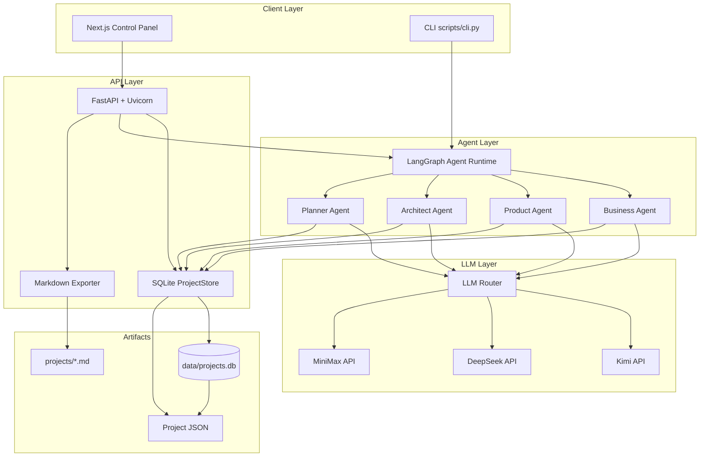

### End-to-end product flow

```text
Idea → Business Analysis → PRD → Architecture → Tasks → Markdown Workspace
```

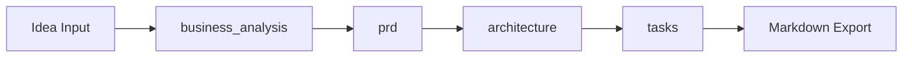

---

## Workflows & Sequence Flows

### User workflow (control panel)

Preview-&-Approve: agents run without auto-saving. The user reviews, edits, then explicitly approves.

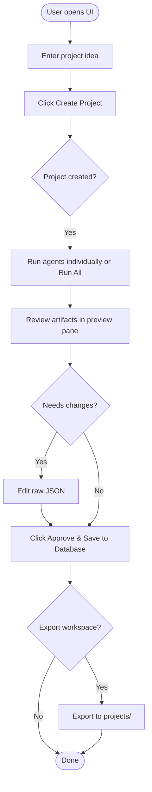

### Sequence: create project, run one agent, approve & save

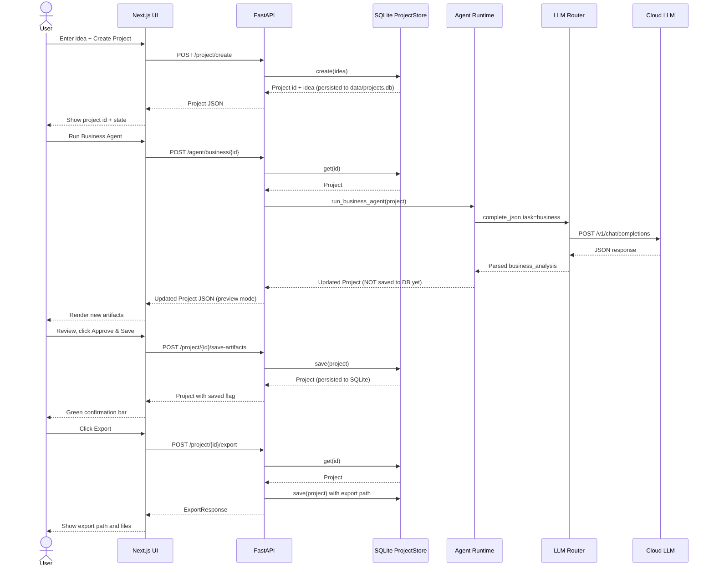

### Sequence: export markdown workspace

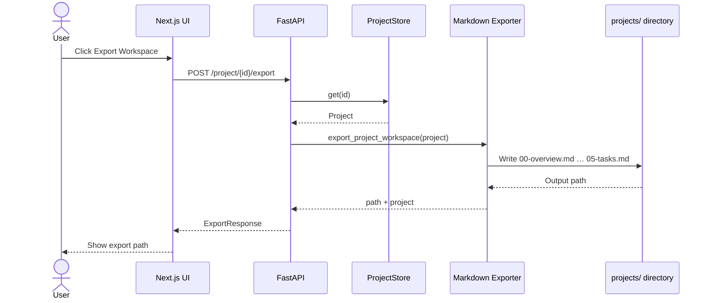

### Agent pipeline (LangGraph full run)

Used by CLI when running all agents in one command. The UI runs agents individually via separate API calls.

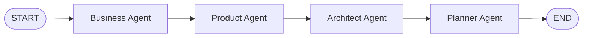

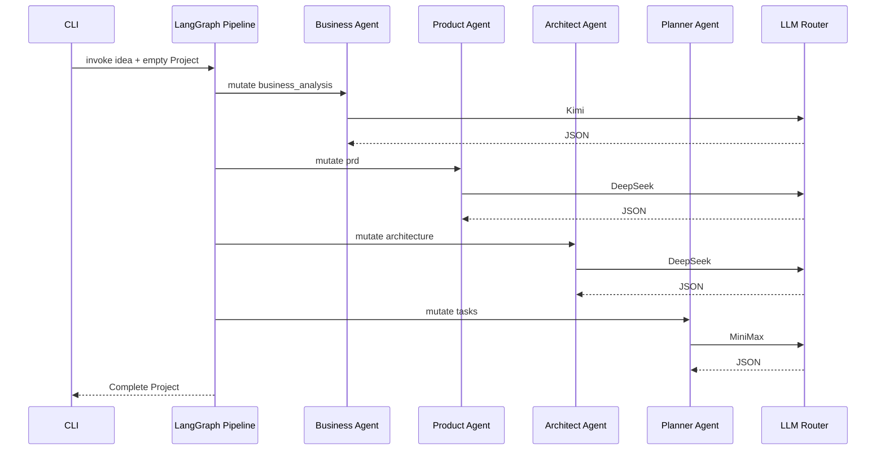

### LLM routing flow

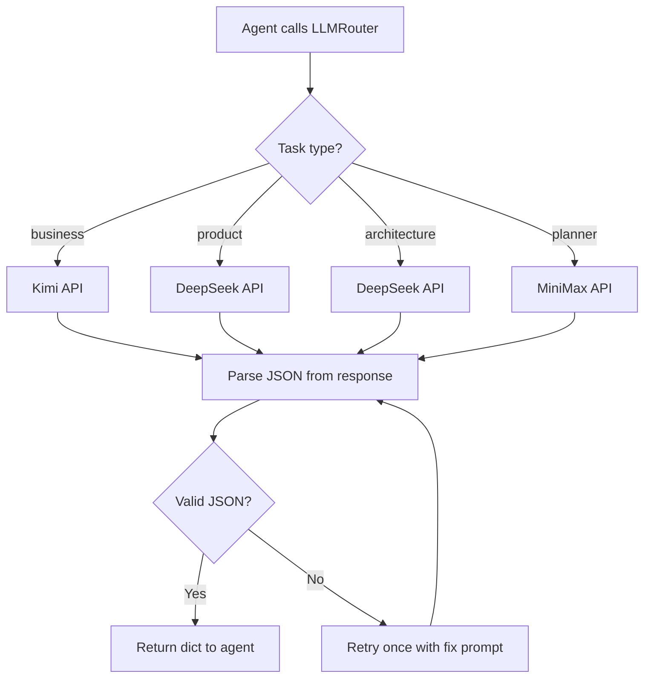

### Single-agent data mutation

Each agent updates only its slice of the shared `Project` object.

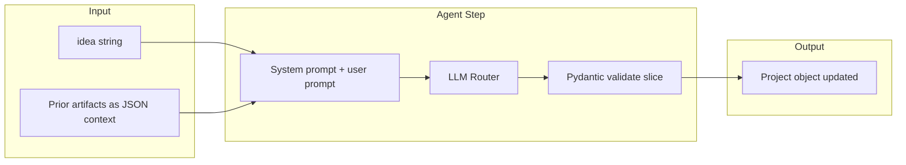

### Request path by entry point

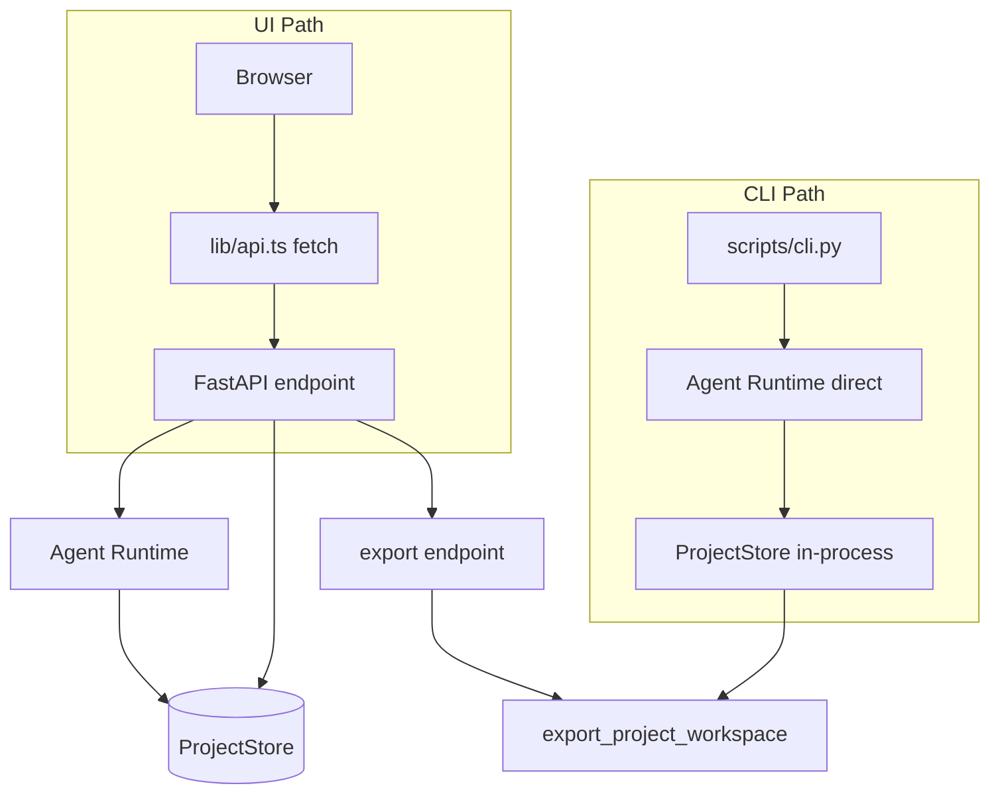

---

## Stack at a Glance

| Layer | Technology | Version / Notes |
|-------|------------|-----------------|
| Language (backend) | Python | ≥ 3.11 |
| Language (frontend) | TypeScript | ^5.7 |
| API framework | FastAPI | ≥ 0.115 |
| ASGI server | Uvicorn | ≥ 0.32 |
| Agent orchestration | LangGraph | ≥ 0.2 |
| LLM abstraction | LangChain Core + custom router | OpenAI-compatible HTTP |
| Data validation | Pydantic | v2 |
| Config | pydantic-settings, python-dotenv | From `.env` |
| HTTP client (LLM) | httpx | Async |
| Frontend framework | Next.js (App Router) | ^15.1 |
| UI library | React | ^19 |
| Storage | SQLite (aiosqlite) | Persistent at `data/projects.db`, WAL mode |
| Export format | Markdown / HTML / Mermaid | `python-slugify` |
| Testing | pytest, pytest-asyncio | 12 backend unit tests |
| Package manager (Python) | pip + setuptools | `pyproject.toml` |
| Package manager (Node) | npm | `package-lock.json` |

---

## Frontend

| Item | Choice | Purpose |
|------|--------|---------|
| Framework | **Next.js 15** (App Router) | Control panel UI, SSR/static pages |
| UI | **React 19** | Components, client state |
| Language | **TypeScript** | Typed API client and components |
| Styling | Inline CSS (MVP) | No CSS framework in v0.1 |
| API client | Native `fetch` | Calls FastAPI at `NEXT_PUBLIC_API_URL` |
| Dev server | `next dev` | Default port **3000** |
| Build | `next build` / `next start` | Production bundle |

### Frontend layout

```text
apps/web/
  app/              # Next.js App Router (layout, page)
  components/       # ControlPanel — create project, run agents, export
  lib/api.ts        # REST client for FastAPI
```

### Environment

| Variable | Default | Description |
|----------|---------|-------------|
| `NEXT_PUBLIC_API_URL` | `http://localhost:8100` | FastAPI base URL |
| `NEXT_PUBLIC_SSE_URL` | — | Deprecated. The SSE endpoint is now accessed via the same-origin Next.js proxy. |

---

## Backend

| Item | Choice | Purpose |
|------|--------|---------|
| Framework | **FastAPI** | REST API, CORS, JSON responses |
| Server | **Uvicorn** | ASGI, `--reload` in dev |
| Schemas | **Pydantic v2** | `Project` and agent output models |
| Settings | **pydantic-settings** | Load LLM keys from environment |
| Store | **SQLite `ProjectStore`** | Persistent via aiosqlite at `data/projects.db` |
| Export | Custom markdown generator | Writes `projects/<slug>/` workspace |

### API surface

| Method | Path | Description |
|--------|------|-------------|
| GET | `/health` | Health check |
| POST | `/project/create` | Create project from idea |
| GET | `/project/{id}` | Get project JSON |
| GET | `/projects` | List all saved projects |
| DELETE | `/project/{id}` | Delete a project |
| POST | `/agent/{name}/{id}` | Run single agent (business/product/architect/planner) |
| POST | `/project/{id}/save-artifacts` | Approve & persist agent artifacts to SQLite |
| POST | `/project/{id}/export` | Export workspace (markdown / html / mermaid) |
| GET | `/project/{id}/export/{format}/download` | Download exported file |
| GET | `/project/{id}/run-all` | SSE stream — run all 4 agents sequentially (native `EventSource`) |

### Backend layout

```text
services/
  api/              # FastAPI app, store, export
  agent_runtime/    # LangGraph workflow + agent runners
  llm_router/       # Multi-provider OpenAI-compatible client
packages/
  schemas/          # Pydantic Project model (source of truth)
  prompts/          # Agent system prompts
scripts/
  cli.py            # Terminal pipeline (create → agents → export)
  reset.sh          # Clean reset — wipes SQLite DB and exported workspaces
```

---

## AI & Agent Layer

| Item | Choice | Purpose |
|------|--------|---------|
| Orchestration | **LangGraph** | Linear pipeline + single-agent execution |
| State | `ProjectState` | `{ idea, project, stage }` |
| Pattern | Artifact-first | Agents mutate slices of `Project`, not chat |
| Execution | Human-in-the-loop | User triggers each agent step (UI or CLI) |

### Agents (MVP)

| Agent | Provider | Model (default) | Output field |
|-------|----------|-----------------|--------------|
| Business Analyst | Kimi (Moonshot) | `kimi-k2.5` | `business_analysis` |
| Product Manager | DeepSeek | `deepseek-v4-pro` | `prd` |
| Architect | DeepSeek | `deepseek-v4-pro` | `architecture` |
| Engineering Planner | MiniMax | `MiniMax-M2.5` | `tasks` |

### LLM router

- **Protocol:** OpenAI-compatible `POST /v1/chat/completions`
- **Client:** httpx (async)
- **Routing:** Task type → provider (see table above)
- **Output:** JSON parsed from LLM response; one retry on malformed JSON
- **Temperature:** Provider-specific (e.g. Kimi requires `1.0`)

### LLM environment variables

See [`.env.example`](../.env.example):

| Provider | Key vars |
|----------|----------|
| DeepSeek | `DEEPSEEK_API_KEY`, `DEEPSEEK_BASE_URL`, `DEEPSEEK_MODEL` |
| Kimi | `KIMI_API_KEY`, `KIMI_BASE_URL`, `KIMI_MODEL` |
| MiniMax | `MINIMAX_API_KEY`, `MINIMAX_BASE_URL`, `MINIMAX_MODEL` |

---

## Data Model

Core object: **`Project`** (Pydantic), defined in `packages/schemas/project.py`.

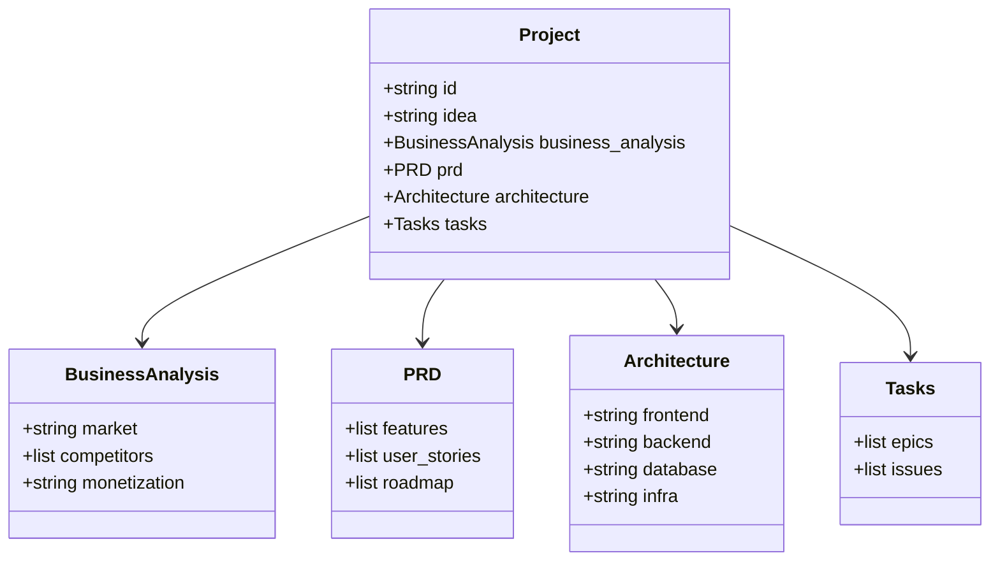

TypeScript types in `apps/web/lib/api.ts` mirror this shape for the UI.

---

## Storage & Artifacts

| Concern | Current | Planned |
|---------|---------|---------|
| Project state | **SQLite** (`data/projects.db`, persistent) | PostgreSQL / Supabase |
| Vector / RAG | Not used | pgvector (future) |
| Exported workspaces | `projects/` directory (gitignored) | Live markdown UI |
| Auth | None | Clerk (planned) |

### Workspace export files

```text
projects/<slug>-<id>/
  00-overview.md
  01-business.md
  02-prd.md
  03-architecture.md
  04-roadmap.md
  05-tasks.md
```

---

## Dev Tooling

| Tool | Role |
|------|------|
| **Make** | `make install`, `make api`, `make web`, `make test`, `make cli` |
| **pytest** | Backend tests (`tests/`) |
| **git** | Version control |
| **markdownlint** | Disabled in workspace via `.markdownlint.json` |
| **VS Code / Cursor** | `.vscode/settings.json` for editor config |

### Python dependencies (`pyproject.toml`)

```text
fastapi, uvicorn, pydantic, pydantic-settings, httpx,
langgraph, langchain-core, python-dotenv, python-slugify,
aiosqlite
```

Dev: `pytest`, `pytest-asyncio`

### Node dependencies (`apps/web/package.json`)

```text
next, react, react-dom
```

Dev: `typescript`, `@types/*`

---

## Monorepo Structure

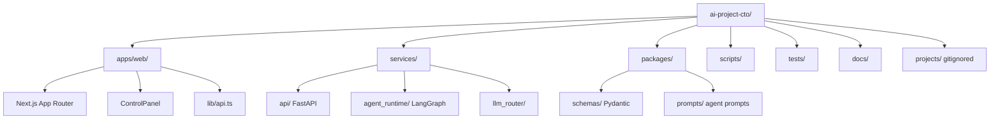

---

## Runtime Ports (local dev)

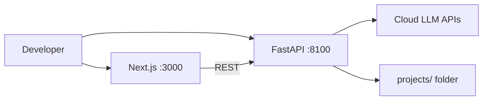

| Service | Port | Command |
|---------|------|---------|
| FastAPI | **8100** | `make api` |
| Next.js | 3000 | `make web` |

---

## Explicitly Not in MVP

| Item | Status |
|------|--------|
| Ollama / local models | Not used (cloud APIs only) |
| PostgreSQL / Supabase | Planned |
| Clerk authentication | Planned |
| Docker / Kubernetes | Planned |
| GitHub repo generator | Planned |
| Coding agent | Out of scope |

## Recent Milestones

| Milestone | Date |
|-----------|------|
| SQLite persistence — Turso/libsql → aiosqlite migration; fixes data isolation bug | June 2026 |
| Preview-&-Approve flow — agents no longer auto-save; explicit approval step | June 2026 |
| ControlPanel UI — stepper, agent cards, editable JSON, saved projects panel | June 2026 |
| Export formats — Markdown workspace + HTML report + Mermaid diagram | June 2026 |

---

## Related Docs

- [README](../README.md) — setup and quick start
- [System overview (v0.1)](chatgpt-1.md) — product vision and principles
- [Implementation log (v0.2)](chatgpt-2.md) — feature behavior
- [Design spec](superpowers/specs/2026-06-24-ai-project-cto-design.md) — MVP design decisions
- [KB snippet](kb.md) — condensed stack reference
